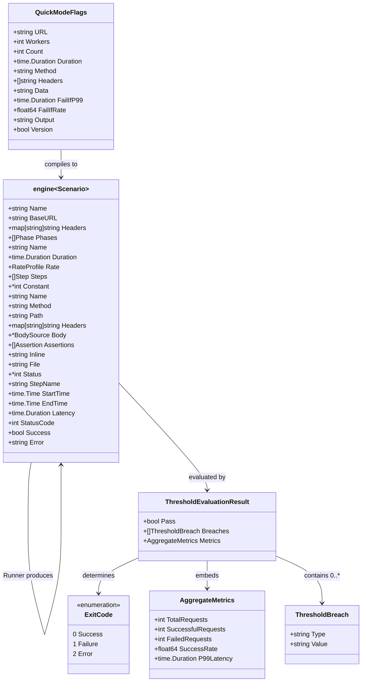

# Data Model: CLI Quick Mode (FR-002)

**Feature**: CLI Quick Mode  
**Phase**: 1 (Design)  
**Date**: 2026-06-20  
**Branch**: `002-cli-quick-mode`

---

## Overview

This document defines the data structures, transformations, and flow for the Quick Mode CLI feature.  
It specifies how raw CLI flags become a compiled `Scenario`, how the `Runner` produces results, how threshold evaluators consume those results, and how the final exit code is determined.

No implementation code is shown; only data models, contracts, and flow diagrams.

---

## 1. QuickModeFlags

`QuickModeFlags` is the **intermediate representation** of all parsed CLI arguments before they are validated and compiled into an `engine.Scenario`.  It is produced by the Cobra flag-parsing layer (`root_cobra.go`) and consumed by the compilation function in `main.go`.

### Structure

| Field | Type | Flag | Default | Validation |
|---|---|---|---|---|
| `URL` | `string` | positional arg | — | Must be a valid HTTP(S) URL; scheme must be `http` or `https`. |
| `Workers` | `int` | `-c`, `--workers` | `1` | Must be `>= 1`. |
| `Count` | `int` | `-n`, `--count` | `0` | Must be `>= 0`. `0` means "use duration mode". |
| `Duration` | `time.Duration` | `-d`, `--duration` | `30s` | Must be `> 0`. |
| `Method` | `string` | `-X`, `--method` | `GET` | Must be a valid HTTP method verb. |
| `Headers` | `[]string` | `-H`, `--header` (repeatable) | `nil` | Each element must contain exactly one `:`. Split on first `:` into `key` / `value`. |
| `Data` | `string` | `-D`, `--data` | `""` | Empty means no body. Prefix `@` means file reference. |
| `FailIfP99` | `time.Duration` | `--fail-if-p99` | `0` | `0` means disabled. Must be `>= 0` if set. |
| `FailIfRate` | `float64` | `--fail-if-rate` | `0` | `0` means disabled. Must be in `[0.0, 1.0]` if set. |
| `Output` | `string` | `-o`, `--output` | `""` | Empty means stdout console. Non-empty is a file path (deferred to v2). |
| `Version` | `bool` | `--version` | `false` | If true, print version and exit `0` immediately. |

### Notes

- `Count` and `Duration` interaction:
  - If `Count > 0`, the compiled phase uses **request-count termination** and `Duration` is ignored for termination logic (the `Runner` still caps with duration as a safety bound).
  - If `Count == 0`, the compiled phase uses **duration-based termination**.
- `Data` prefixed with `@` is transformed into a `BodySource{File: ...}`; otherwise `BodySource{Inline: ...}`.
- `Headers` strings are parsed into `map[string]string` before compilation.

---

## 2. CompiledScenario

`CompiledScenario` is the **single-phase `engine.Scenario`** synthesized from `QuickModeFlags`.  It reuses all existing engine types with no new structures.

### Compilation Mapping

```text
QuickModeFlags
    │
    ▼
┌─────────────────────────────────────────────┐
│ engine.Scenario                             │
│   Name:    "quick"                            │
│   BaseURL:  <scheme>://<host>                 │
│   Headers:  <global headers from -H>          │
│   Phases: [                                   │
│     engine.Phase                              │
│       Name:     "load"                        │
│       Duration: flags.Duration (or fallback)  │
│       Rate:     engine.RateProfile            │
│         Constant: &flags.Workers              │
│       Steps: [                                │
│         engine.Step                           │
│           Name:       "request"                 │
│           Method:     flags.Method              │
│           Path:       <url.Path + query>        │
│           Headers:    <per-step headers>        │
│           Body:       <BodySource>              │
│           Assertions: [                       │
│             { Status: intPtr(200) }           │
│           ]                                   │
│       ]                                       │
│   ]                                           │
└─────────────────────────────────────────────┘
```

### Field-by-Field Mapping

| QuickModeFlags | engine.Scenario / Phase / Step | Transform |
|---|---|---|
| `URL.Scheme + "://" + URL.Host` | `Scenario.BaseURL` | Host-level base URL. |
| `URL.Path + URL.RawQuery` | `Step.Path` | Preserves query string. |
| `Workers` | `Phase.Rate.Constant` | Pointer to int; constant concurrency. |
| `Duration` | `Phase.Duration` | Direct assignment. |
| `Method` | `Step.Method` | Upper-cased by HTTP driver. |
| `Headers` | `Scenario.Headers` (global) and `Step.Headers` (merged) | All headers placed at Scenario level for simplicity in v1. |
| `Data` | `Step.Body` | `BodySource{Inline: ...}` or `BodySource{File: ...}` based on `@` prefix. |
| `Count` | Termination logic | Count > 0 causes Runner to stop after N successful requests. Handled outside Scenario struct by wrapping the driver or Runner invocation. |

### Notes

- The compiled Scenario always contains **exactly one Phase** and **exactly one Step** inside that phase.
- No `Setup`, `Teardown`, or `Captures` are populated in Quick Mode v1.
- The default assertion `{Status: 200}` is injected unless explicitly overridden in a future version.
- `Count` termination is not a property of `engine.Scenario` today; the Runner will be invoked with a stop condition derived from `Count`.

---

## 3. ThresholdEvaluators

After `Runner.Run()` returns `[]*engine.Result`, threshold evaluators compute aggregate statistics and compare them against the thresholds declared in `QuickModeFlags`.

### Input Data

| Source | Type | Description |
|---|---|---|
| `results` | `[]*engine.Result` | All results returned by `Runner.Run()`. |
| `flags.FailIfP99` | `time.Duration` | Threshold for p99 latency. |
| `flags.FailIfRate` | `float64` | Threshold for minimum success rate. |

### Derived Metrics (computed from results)

| Metric | Formula | Type |
|---|---|---|
| `TotalRequests` | `len(results)` | `int` |
| `SuccessfulRequests` | `count(r.Success == true)` | `int` |
| `FailedRequests` | `TotalRequests - SuccessfulRequests` | `int` |
| `SuccessRate` | `SuccessfulRequests / TotalRequests` | `float64` (0.0–1.0) |
| `P99Latency` | 99th percentile of `r.Latency` | `time.Duration` |

### Threshold Evaluation Rules

| Threshold | Enabled When | Breach Condition |
|---|---|---|
| `FailIfP99` | `> 0` | `P99Latency > FailIfP99` |
| `FailIfRate` | `> 0` | `SuccessRate < FailIfRate` |

### Evaluator Output

```text
ThresholdEvaluationResult
├── Pass:      bool    // true if all enabled thresholds pass
├── Breaches:  []ThresholdBreach
│     ├── Type:   string   // "p99" | "rate"
│     └── Value:  string   // human-readable observed value
└── Metrics:   AggregateMetrics
      ├── TotalRequests      int
      ├── SuccessfulRequests int
      ├── FailedRequests     int
      ├── SuccessRate        float64
      └── P99Latency         time.Duration
```

### Notes

- Threshold evaluation happens **after** `Runner.Run()` returns and **before** exit code determination.
- If zero thresholds are enabled, evaluation always passes.
- If `TotalRequests == 0`, thresholds cannot be evaluated meaningfully; this is treated as a pass (but the Runner error path should have already exited 2 or 1).

---

## 4. ExitCodeDeterminator

The exit code is the **final observable behavior** of `htload`.  It is determined by combining:
1. CLI parsing success/failure
2. Runner execution results
3. Threshold evaluation results

### Decision Matrix

```text
┌─────────────────────────────────────────────────────────────────────┐
│                         Exit Code Determinator                        │
├─────────────────────────────────────────────────────────────────────┤
│  Condition                                         │ Exit Code      │
├────────────────────────────────────────────────────┼────────────────┤
│  --version flag given                               │ 0              │
│  Invalid arguments (validation error, bad URL,      │ 2              │
│   malformed header, missing file, etc.)             │                │
│  Transport error before any request (DNS fail,     │ 2              │
│   conn refused with zero results)                   │                │
│  Runner returns error AND zero results              │ 2              │
├────────────────────────────────────────────────────┼────────────────┤
│  At least one result has Success == false           │ 1              │
│   (assertion failure or transport error on request) │                │
│  Threshold evaluation fails (any breach)              │ 1              │
├────────────────────────────────────────────────────┼────────────────┤
│  All results have Success == true                   │ 0              │
│  AND all enabled thresholds pass                     │                │
│  AND at least one request was executed               │                │
└─────────────────────────────────────────────────────────────────────┘
```

### Formal Logic

```text
if flags.Version {
    return 0
}

if parseError || validationError {
    return 2
}

results, err := runner.Run(...)
if err != nil && len(results) == 0 {
    return 2
}

thresholdsPass := evaluateThresholds(results, flags)
hasFailures := any(result.Success == false for result in results)

if hasFailures || !thresholdsPass {
    return 1
}

return 0
```

### Exit Code Semantics

| Code | Meaning | Consumer (CI/CD) Interpretation |
|---|---|---|
| `0` | Success — all requests passed assertions and thresholds. | Pipeline continues. |
| `1` | Soft failure — at least one request failed its assertion or a threshold was breached. | Pipeline stage fails; review logs. |
| `2` | Hard failure — invalid input or unrecoverable runtime error before meaningful results. | Pipeline stage fails; likely misconfiguration. |

---

## Data Flow Diagram

```mermaid
flowchart LR
    subgraph CLI["CLI Layer (root_cobra.go)"]
        C1[Cobra Flag Parsing]
    end

    subgraph QM["Quick Mode Compilation (main.go)"]
        Q1[QuickModeFlags struct]
        Q2[Validate Flags]
        Q3[Compile to Scenario]
    end

    subgraph ENG["Engine (pkg/engine)"]
        E1[engine.Scenario]
        E2[Runner.Run]
        E3["[]*engine.Result"]
    end

    subgraph THR["Threshold Evaluation"]
        T1[Compute Aggregates]
        T2[ThresholdEvaluators]
        T3[ThresholdEvaluationResult]
    end

    subgraph OUT["Exit Determination"]
        X1[ExitCodeDeterminator]
        X2[os.Exit]
    end

    C1 -->|produces| Q1
    Q1 -->|validates| Q2
    Q2 -->|compiles| Q3
    Q3 -->|yields| E1
    E1 -->|executed by| E2
    E2 -->|returns| E3
    E3 -->|fed into| T1
    T1 -->|checked by| T2
    T2 -->|produces| T3
    T3 -->|combined with results| X1
    X1 -->|calls| X2

    style CLI fill:#e8f4f8,stroke:#084c61
    style QM fill:#fff3cd,stroke:#856404
    style ENG fill:#d4edda,stroke:#155724
    style THR fill:#f8d7da,stroke:#721c24
    style OUT fill:#e2e3e5,stroke:#383d41
```



---

## Type Relationship Diagram



---

## Cross-Reference

| Artifact | Reference |
|---|---|
| Feature specification | [`spec.md`](./spec.md) |
| Research & decisions | [`research.md`](./research.md) |
| External contracts | [`contracts/quickmode.md`](./contracts/quickmode.md) |
| Usage examples | [`quickstart.md`](./quickstart.md) |
| Implementation plan | [`plan.md`](./plan.md) |
| Engine types | `/Users/andhi/code/mdstn/ogou/pkg/engine/types.go` |
| Runner execution | `/Users/andhi/code/mdstn/ogou/pkg/engine/runner.go` |
| Console reporter | `/Users/andhi/code/mdstn/ogou/pkg/reporter/console.go` |
